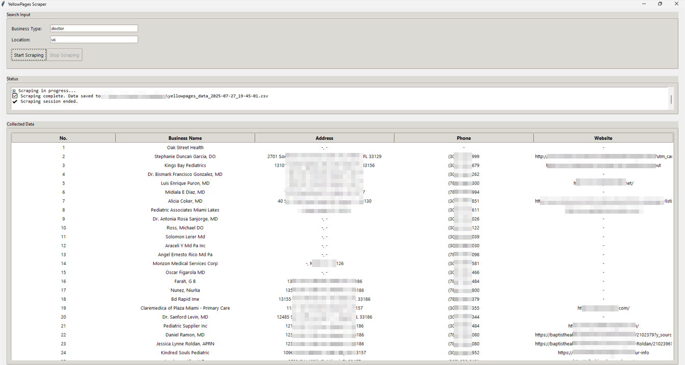

# 🟡 YellowPages Business Scraper

A simple GUI-based web scraping tool to extract business listings from [YellowPages](https://www.yellowpages.com/).
Built using **Selenium** for web scraping and **Tkinter** for the desktop GUI.

---

## 📸 Screenshot

> 

*(Add a screenshot named `img.png` in your repo)*

---

## ⚙️ Features

* 🔍 Search businesses by keyword and location
* 🧾 Extract details: Business Name, Address, Phone, Website
* 📎 Saves data automatically into a timestamped `.csv` file
* 📊 Displays results directly in the GUI
* ✅ Uses ChromeDriver automatically via `webdriver-manager`
* 🔁 Easy-to-use interface with Start/Stop controls

---

## 🛠️ Installation

### 1. Clone this repository

```bash
git clone https://github.com/your-username/yellowpages-scraper.git
cd yellowpages-scraper
```

### 2. Create a virtual environment (optional but recommended)

```bash
python -m venv venv
source venv/bin/activate  # On Windows: venv\Scripts\activate
```

### 3. Install dependencies

```bash
pip install -r requirements.txt
```

If you don't have `requirements.txt`, create it with:

```txt
selenium
pandas
webdriver-manager
```

---

## ▶️ How to Run

```bash
python gui.py
```

* Enter **Business Type** (e.g., plumber, restaurant)
* Enter **Location** (e.g., New York, San Francisco)
* Click **Start Scraping**
* View live status and results in the GUI
* Data will be saved in a CSV file like `yellowpages_data_2025-07-27_15-30-00.csv`

---

## 📂 Output Format

The CSV will include:

| Business Name | Address | Phone | Website |
| ------------- | ------- | ----- | ------- |

---

## ⛔ Notes

* The scraper uses **headless Chrome** mode. You can disable it by removing this line in `scraper.py`:

  ```python
  options.add_argument("--headless")
  ```
* Make sure your internet connection is active while scraping.
* Scraping too frequently may result in temporary blocking by YellowPages.

---

## 📌 To Do

* Add export to Excel
* Filter/search within GUI
* Better stop control (currently relies on page loop end)

---

## 🙏 Credits

* [Selenium](https://selenium.dev/)
* [Tkinter](https://docs.python.org/3/library/tkinter.html)
* [YellowPages](https://www.yellowpages.com/) – Data Source
* [WebDriver Manager](https://github.com/SergeyPirogov/webdriver_manager)

---

## 📄 License

This project is licensed under the MIT License. See `LICENSE` file for details.
